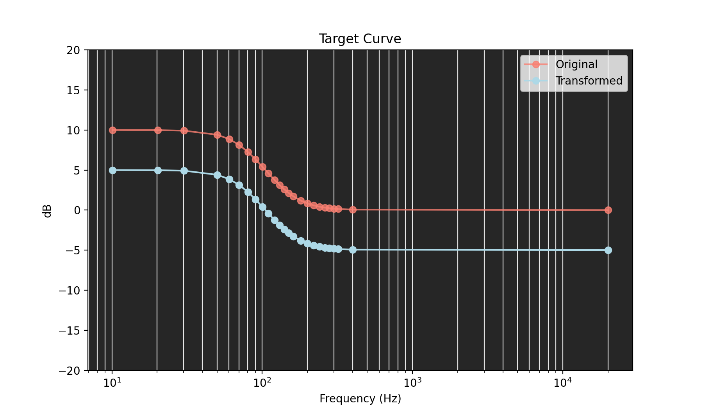

# Dirac Targetcurve Transformer

## Introduction
Dirac's graphical user interface allows adding points to a target curve and manipulating their frequency and decibels position, 
but there is no way to select a group of points and move all of them together, like what typical
function of software digital audio workstations.

This python script allows you to apply gain, attenuation, compression, expansion, and limiter 
to all breakpoints within a frequency range you define. Then you can output the new `*.targetcurve` file, import it to Dirac 
and continue tweaking the target curve by individual points using the GUI.

## Run the script
```
$ python dirac.py "/source/of/file.targetcurve"
```

## Options
```
Choose Target curve Modification:
1. Gain
2. Attenuate
3. Compress
4. Expand
5. Limit
6. Graph
7. Write to new .targetcurve file
8. Quit

```

## Example: Gain
The default bandwidth range is `0Hz` - `20kHz` but this can be changed by the user.
```
Low Frequency cutoff for transformation [0 Hz]: 
High Frequency cutoff for transformation [20 kHz]:  
Gain by __ dB [0]:1

```
## Graph the Transformation
Matplotlib is used to graph the new breakpoints. 
Close the graph window to continue the script.



## Save the file
Choose `7` to create a filename and write this transformation to the new file. 
Import the new file into Dirac Live to continue building your filter.  


## Developer: TargetCurve module
Here is the structure of the TargetCurve module
Usage
```
from TargetCurve import TargetCurve

# file is loaded and parsed to instance properties
target_curve = TargetCurve("path/to/your/file.targetcurve")

# print of properties
target_curve.description()

# transform curve
target_curve.transform_breakpoints(operation, dB_change, bandpass_low_freq, bandpass_high_freq)

# write new file
target_curve.write_transformed('target/filename.targetcurve')

```

| parameter | description |
|---|---|
| operation | `Operation.Gain`  `Operation.Attenuate` `Operation.Compress` `Operation.Expand` `Operation.Limit`|
| dB_change | value to add in `.Gain` or subtract in `.Attenuate` modes (use positive values for both) Percent change in `.Compress` and `.Expand` modes. Upper limit in `.Limit`.
| bandpass_low_freq| lowest frequency cutoff in Hz for transformation to have effect |
| bandpass_high_freq| highest frequency cutoff in Hz for transformation to have effect |
